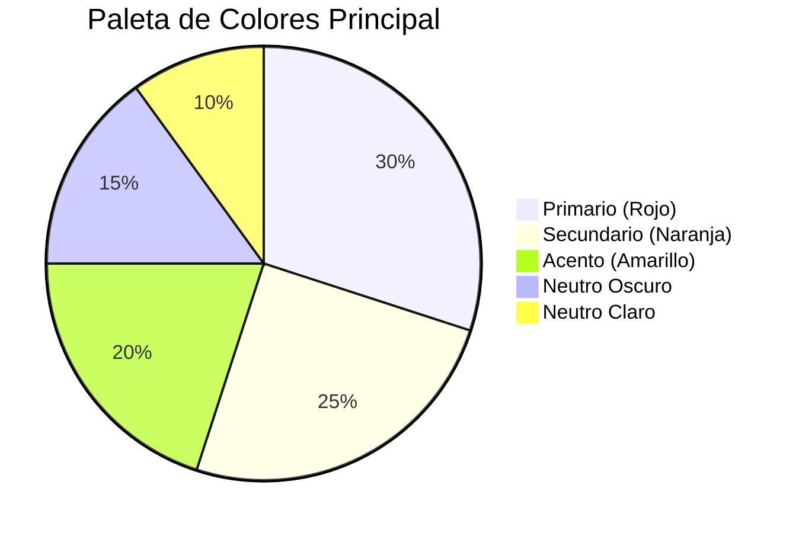
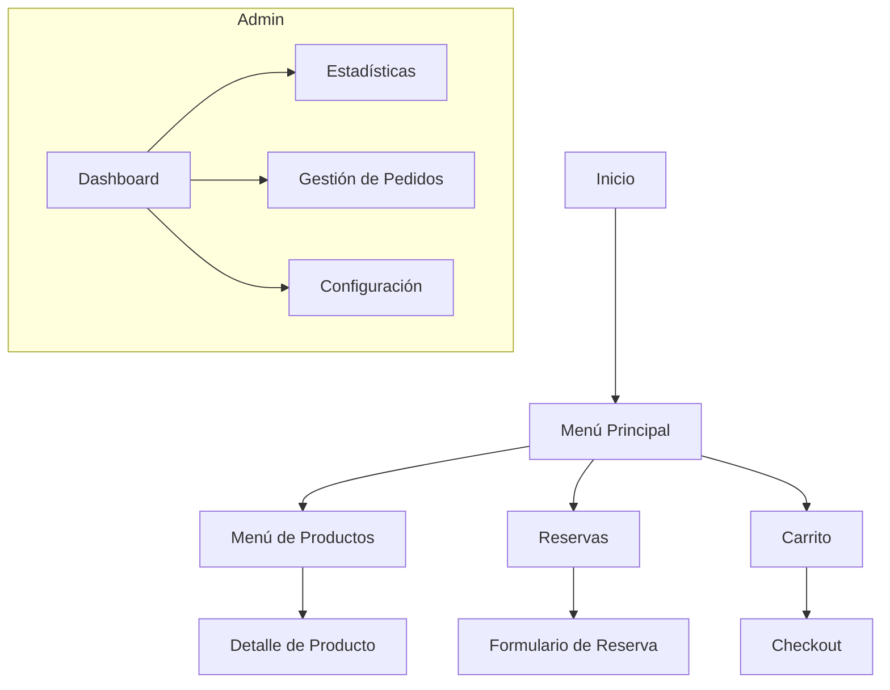

# Sistema de Diseño para Restaurante App

## Paleta de Colores (Restaurante Casual - Colores Cálidos)



### Variables CSS para Bootstrap
```css
:root {
  --bs-primary: #E74C3C;       /* Rojo cálido */
  --bs-secondary: #F39C12;      /* Naranja vibrante */
  --bs-success: #27AE60;       /* Verde para disponibilidad */
  --bs-danger: #C0392B;        /* Rojo oscuro para errores */
  --bs-warning: #F1C40F;       /* Amarillo para alertas */
  --bs-info: #3498DB;          /* Azul para información */
  --bs-light: #ECF0F1;         /* Fondo claro */
  --bs-dark: #2C3E50;          /* Texto oscuro */
  --bs-body-bg: #FFFFFF;       /* Fondo principal */
  --bs-font-sans-serif: 'Poppins', sans-serif;
}
```

## Tipografía
- **Principal:** Poppins (Google Fonts) - Moderna y legible
- **Secundaria:** Open Sans para contenido largo
- **Tamaños:**
  - Títulos: 2.5rem - 1.2rem (responsivo)
  - Cuerpo: 1rem
  - Pequeño: 0.875rem

## Componentes Clave Identificados

### 1. Menú Público
- Tarjetas de productos con imágenes
- Sistema de etiquetas (vegetariano, picante, nuevo)
- Botones interactivos de "Agregar al carrito"
- Filtros por categoría

### 2. Sistema de Reservas
- Formulario de reserva con selector de fecha/hora
- Visualización de mesas disponibles
- Confirmación modal con detalles

### 3. Dashboard Administrativo
- Tarjetas de estadísticas (ventas, reservas, ocupacion)
- Tabla de pedidos en tiempo real
- Gráficos de rendimiento

### 4. POS (Punto de Venta)
- Interfaz de mesas con estado visual
- Modal de pedido rápido
- Sistema de pago integrado

## Wireframes Conceptuales



## Estructura de Archivos Propuesta para Bootstrap

```
src/
├── assets/
│   ├── css/
│   │   ├── bootstrap.min.css
│   │   ├── custom-bootstrap.scss
│   │   └── theme.css
│   └── js/
│       └── bootstrap.bundle.min.js
├── styles/
│   ├── _variables.scss
│   ├── _components.scss
│   └── _utilities.scss
```

## Componentes Bootstrap a Implementar

1. **Navbar Responsivo** con logo y menú desplegable
2. **Cards** para productos del menú con hover effects
3. **Modals** para detalles de productos y confirmaciones
4. **Forms** con validación visual para reservas
5. **Alerts** para notificaciones del sistema
6. **Badges** para etiquetas de productos
7. **Carousel** para promociones destacadas
8. **Offcanvas** para carrito de compras móvil

## Guía de Implementación

### Instalación de Bootstrap
```bash
# Instalar Bootstrap via npm (recomendado)
npm install bootstrap @popperjs/core

# O usar CDN en index.html (ya implementado)
<link href="https://cdn.jsdelivr.net/npm/bootstrap@5.3.2/dist/css/bootstrap.min.css" rel="stylesheet">
<script src="https://cdn.jsdelivr.net/npm/bootstrap@5.3.2/dist/js/bootstrap.bundle.min.js"></script>
```

### Estructura de Archivos CSS
```
src/
├── assets/
│   ├── css/
│   │   ├── bootstrap.min.css          # Bootstrap core
│   │   ├── custom-bootstrap.scss      # Variables y componentes personalizados
│   │   └── theme.css                  # Estilos globales adicionales
├── app/
│   └── app.css                        # Estilos globales de la aplicación
```

### Uso de Componentes

#### Navbar
```html
<nav class="navbar navbar-expand-lg navbar-dark bg-primary">
  <div class="container">
    <a class="navbar-brand" href="#">Restaurante</a>
    <button class="navbar-toggler" type="button" data-bs-toggle="collapse">
      <span class="navbar-toggler-icon"></span>
    </button>
    <div class="collapse navbar-collapse">
      <!-- Enlaces de navegación -->
    </div>
  </div>
</nav>
```

#### Cards de Menú
```html
<div class="card menu-card">
  
  <div class="card-body">
    <h5 class="card-title">Nombre del Plato</h5>
    <p class="card-text">Descripción del plato</p>
    <div class="d-flex justify-content-between">
      <span class="price">S/ 28.00</span>
      <button class="btn btn-primary">Agregar</button>
    </div>
  </div>
</div>
```

#### Formularios
```html
<form class="reservation-form">
  <div class="mb-3">
    <label for="name" class="form-label">Nombre</label>
    <input type="text" class="form-control" id="name" required>
    <div class="invalid-feedback">Campo requerido</div>
  </div>
  <button type="submit" class="btn btn-primary">Reservar</button>
</form>
```

## Sistema de Diseño Completo

### Paleta de Colores Final
- **Primario:** #E74C3C (Rojo cálido)
- **Secundario:** #F39C12 (Naranja)
- **Éxito:** #27AE60 (Verde)
- **Peligro:** #C0392B (Rojo oscuro)
- **Advertencia:** #F1C40F (Amarillo)
- **Información:** #3498DB (Azul)
- **Claro:** #ECF0F1
- **Oscuro:** #2C3E50

### Tipografía
- **Principal:** Poppins (300, 400, 500, 600, 700)
- **Secundaria:** Open Sans (400, 600)

### Espaciado
- Base: 1rem (16px)
- Escala: 0.25rem, 0.5rem, 1rem, 1.5rem, 2rem, 3rem

### Sombras
- Pequeña: 0 0.125rem 0.25rem rgba(0,0,0,0.075)
- Media: 0 0.5rem 1rem rgba(0,0,0,0.1)
- Grande: 0 1rem 3rem rgba(0,0,0,0.15)

### Border Radius
- Pequeño: 0.25rem
- Base: 0.375rem
- Grande: 0.5rem
- Extra Grande: 0.75rem
- Circular: 50%

## Buenas Prácticas

1. **Consistencia:** Usar siempre las clases de Bootstrap para mantener uniformidad
2. **Responsividad:** Probar todos los componentes en diferentes tamaños de pantalla
3. **Accesibilidad:** Asegurar contraste adecuado y etiquetas ARIA
4. **Rendimiento:** Minificar CSS y usar solo los componentes necesarios
5. **Mantenimiento:** Documentar cambios y seguir la guía de estilos

## Recursos Adicionales
- [Documentación oficial de Bootstrap 5](https://getbootstrap.com/docs/5.3/)
- [Guía de colores](https://coolors.co/)
- [Google Fonts - Poppins](https://fonts.google.com/specimen/Poppins)
- [Font Awesome Icons](https://fontawesome.com/)